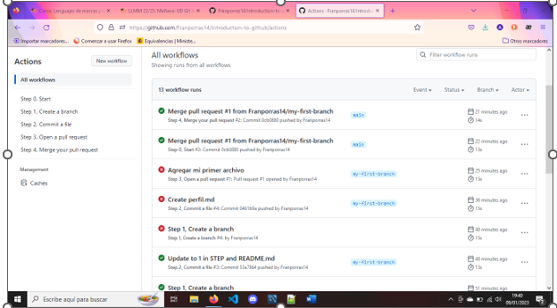

# UDGit A1. Introduction to GitHub

Realiza el siguiente [curso](https://github.com/skills/introduction-to-github) diseñado por el equipo de formación de GitHub. Forma parte de un conjunto de cursos interactivos diseñados para principiantes en el uso de GitHub.
Te introduce en el desarrollo colaborativo mediante GitHub: una herramienta de control de versiones. Trabajarás con un repositorio de prueba sobre el que realizarás unos pasos clave.
Entrega un pantallazo que demuestre que lo has finalizado y responde a las siguientes preguntas:

 
1. Busca en Wikipedia e indica:

- Qué es GitHub y su relación con Git?

  GitHub es una forja (plataforma de desarrollo colaborativo) para alojar proyectos utilizando el sistema de control de versiones de Git. Se utiliza principalmente para la creación de código fuente de programas de ordenador. El Software que opera GitHub fue escrito en Ruby on Rails. Desde enero de 2010, GitHub opera bajo el nombre de GitHub, Inc. Anteriormente era conocida como Logical Awesome LLC. El código de los proyectos alojados en GitHub se almacena generalmente de forma pública.

- Compañía dueña de GitHub

  Microsoft es oficialmente dueño de Github.

2. Qué es una rama en el código (branch of the code)

   Cuando hablamos de ramificaciones, significa que tú has tomado la rama principal de desarrollo y a partir de ahí has continuado trabajando sin seguir la rama principal de desarrollo. Uno de los puntos más fuertes de GitHub es su sistema de ramificaciones y lo cierto es que esto le hace resaltar sobre los otros sistemas de control de versiones. La forma en la que GitHub maneja las ramificaciones es increíblemente rápida, haciendo así de las operaciones de ramificación algo casi instantáneo, al igual que el avance o el retroceso entre distintas ramas, lo cual también es tremendamente rápido. A diferencia de otros sistemas de control de versiones, GitHub promueve un ciclo de desarrollo donde las ramas se crean y se unen ramas entre sí, incluso varias veces en el mismo día. Entender y manejar esta opción te proporciona una poderosa y exclusiva herramienta que puede, literalmente, cambiar la forma en la que desarrollas

3. Qué es una nueva característica en el código (new feature)

   Una señal que indica que hay código nuevo o modificado respectoa commits anteriores

4. Qué es un pull request

   Procesos de revisión de código, son solicitudes de admisión de código. Los usuarios pueden editar cualquier archivo de código de un repositorio, ya sea a través del editor integrado de GitHub o desde su ambiente local. Cuando el usuario ha editado uno o varios archivos, puede enviar la solicitud al repositorio que quiere modificar. Se creará una solicitud en la pestaña de pull requests, donde el creador del repositorio o los colaboradores pueden decidir si aceptar o denegar la solicitud. Adicionalmente, pueden revisar el código y enviar comentarios a modo de retroalimentación, también es posible asignar usuarios y etiquetas a las pull requests.

5. Qué es un merge

   Git merge fusiona dos ramas o branches en una y te permite guardar tus cambios con seguridad. En la mayoría de los casos, las diferentes líneas de desarrollo se integran en la rama main.

6. Qué es un issue

   Los Issues, llamados «propuestas» en español, se asemejan, en cierta medida, a los hilos en algunos foros y redes sociales: son publicaciones que tratan sobre una cuestión en específico. En GitHub, los issues son abiertos por usuarios que tienen un fallo con el código del repositorio y quieren recibir ayuda para solucionarlo, por usuarios que quieren plantear una compleja mejora del programa, entre otros usos. Se pueden enlazar pull requests a los issues, así como asignar usuarios y etiquetas.

7. Qué es una mención y qué implica
 
   Sirve para indicar quien es el autor

8. Qué es una etiqueta (label) y por qué su uso
9. Qué son las notificaciones. Indica las tres opciones de notificaciones

   Github tiene laa opcion de enviar notificacione, y las distintas formas de hacerlo son:

   Notificar toda la actividad.

   Notificar menciones

   Ignorar

10. Qué son GitHub Pages

    GitHub ofrece un servicio con el que los usuarios pueden subir un sitio web directamente desde los servidores de GitHub, sin la necesidad de un almacenamiento externo en la nube. Estas páginas pueden ser creadas tanto para proyectos como para usuarios (a modo de portfolio), y el proceso es muy sencillo, pues basta con ir a la configuración del repositorio y a la sección de GitHub Pages. Es necesario que en el repositorio haya una estructura de archivos de sitios web que pueda ser leído por GitHub (como HTML); GitHub hará todo el trabajo automáticamente, pero el usuario puede cambiar la fuente de publicación si decide almacenar los archivos en un directorio diferente

11. Qué es GitHub Flow

    Git Flow es una estrategia creada para mejorar la organización de Branchs (ramificaciones) dentro del repositorio y, de esta forma, dar más fluidez al proceso de nuevos Features y Releases. Está centralizado como SVN y también está descentralizado, lo que permite que muchos equipos trabajen de forma independiente entre ellos, siempre pasando por el repositorio central.

    Esto ayuda a no tener el riesgo de mergear o hacer commit sobre un trunk o repositorio que está utilizado por muchas personas.

    Aparte de eliminar ese factor de riesgo, siempre integra código en fases muy tempranas, de forma que los equipos puedan trabajar de forma independiente, y al final mergean su código hasta llegar a la rama principal  

De interés

- https://skills.github.com/
